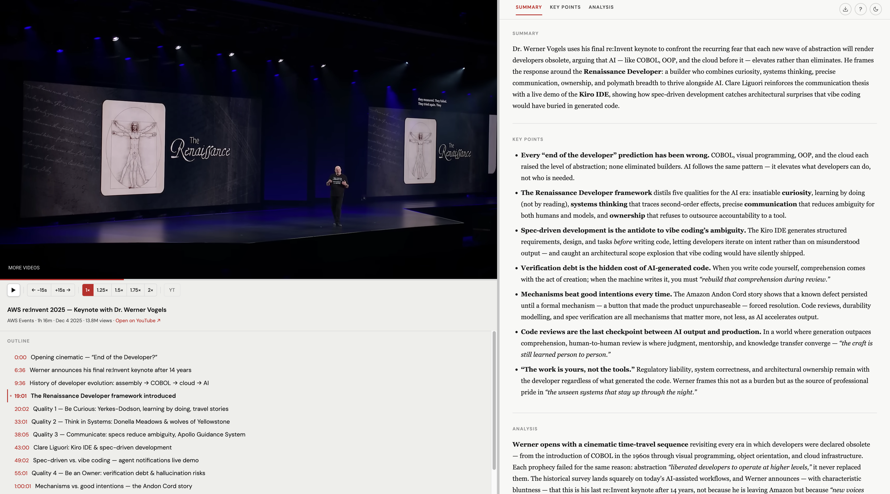

# video-lens

**Turn any YouTube video into a polished research report.**

video-lens is a [Claude Code](https://docs.anthropic.com/en/docs/claude-code) skill that fetches a YouTube transcript and generates a structured HTML report — executive summary, takeaway, key points with analysis, timestamped topic outline, and an embedded in-page player.

> Fork of [kar2phi/video-lens](https://github.com/kar2phi/video-lens), adapted for Linux and simplified to Claude Code only.



---

## What you get

- **Executive summary** — 3-5 sentence TL;DR overview
- **Takeaway** — the single most important insight (1-3 sentences)
- **Key points** — bulleted, scannable insights with supporting detail
- **Timestamped outline** — click topics to expand summaries; click timestamps to jump the player
- **In-page YouTube player** — watch while reading; auto-highlights the current section
- **Keyboard shortcuts** — playback speed, layout resize (S/M/L), navigation, and more (`?` for help)
- **Markdown export** — copy the full report as Markdown in one click
- **Dark mode** — auto-detects system preference; remembered across sessions
- **Video gallery** — browse, search, and filter all your saved reports by title, channel, tag, or keyword

---

## Requirements

| Tool | Purpose |
| --- | --- |
| [Claude Code](https://docs.anthropic.com/en/docs/claude-code) | Runs the skill |
| Python 3 | Fetches the transcript |
| **Optional:** [Task](https://taskfile.dev) | Install/dev commands alias |

> **Note:** video-lens only works for videos that have captions/subtitles available. Videos with captions disabled will produce an error.

---

## Install

### Option A — Manual install (no clone needed)

```bash
mkdir -p ~/.claude/skills/video-lens && \
curl -Lo ~/.claude/skills/video-lens/SKILL.md https://raw.githubusercontent.com/Gdetrane/video-lens/main/skills/video-lens/SKILL.md && \
curl -Lo ~/.claude/skills/video-lens/template.html https://raw.githubusercontent.com/Gdetrane/video-lens/main/skills/video-lens/template.html && \
pip install youtube-transcript-api yt-dlp
```

### Option B — Full install (with dev tools)

```bash
git clone https://github.com/Gdetrane/video-lens.git
cd video-lens
task install-libraries
task install-skill-local
```

---

## Usage

### In Claude Code

```
/video-lens https://www.youtube.com/watch?v=...
```

Claude fetches the transcript, generates the report, and opens it in your browser at `http://localhost:8765/`.

### Gallery

Browse, search, and filter all your saved reports by title, channel, tag, or keyword:


After generating reports, open the gallery:

```
/video-lens-gallery
```

Or rebuild the index manually:

```bash
task build-index
```

The gallery opens at `~/Downloads/video-lens/index.html`.

---

## Dev server

To iterate on `skills/video-lens/template.html` without running a real video:

```bash
task dev
```

Opens a rendered sample report at `http://localhost:8765/sample_output.html`.

## Tests

```bash
task test          # fast integration tests (no LLM)
task test-full     # includes real Claude session (slow)
```

---

## Repo layout

```
video-lens/
  skills/
    video-lens/
      SKILL.md             <- skill prompt (source of truth)
      template.html        <- HTML report template (source of truth)
      scripts/
        fetch_transcript.py
        fetch_metadata.py
        render_report.py
        serve_report.sh
    video-lens-gallery/
      SKILL.md             <- gallery skill prompt (source of truth)
      index.html           <- gallery viewer (source of truth)
      scripts/
        backfill_meta.py   <- backfills meta blocks into old reports
        build_index.py     <- builds manifest.json and copies index.html
  scripts/
    yt_template_dev.py     <- dev server helper
  tests/
    test_e2e.py            <- integration tests
  Taskfile.yml
  requirements.txt
```

**Always edit files in this repo, then deploy with `task install-skill-local`.** Never edit directly in `~/.claude/skills/`.

---

## Changes from upstream

This fork diverges from [kar2phi/video-lens](https://github.com/kar2phi/video-lens) in several ways:

- **Linux-only** — removed macOS dependencies (Homebrew, Deno, Raycast, iTerm2)
- **Claude Code only** — removed multi-agent support (Copilot, Gemini, Cursor)
- **Extracted scripts** — transcript fetching, metadata, and rendering moved from inline skill code to standalone Python scripts
- **Security hardening** — input validation, safe subprocess calls
- **Tests** — e2e test suite with pytest

---

## Contributing

PRs welcome. Keep the skill prompt in `skills/video-lens/SKILL.md` and the HTML template in `skills/video-lens/template.html` — those are the sources of truth.

## License

MIT
